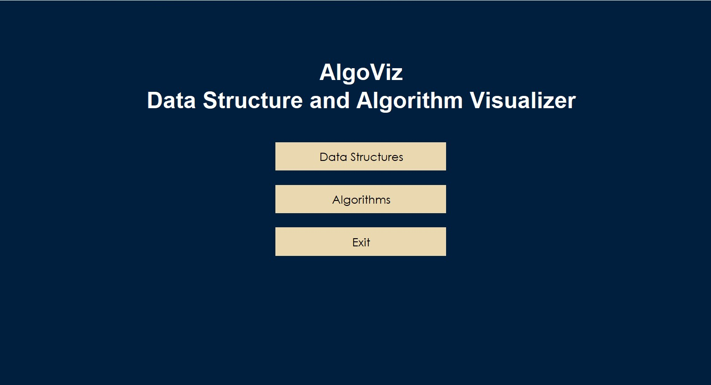

# Data Structure & Algorithm Visualizer

A Java-based interactive visualizer that helps users understand core Data Structures and Algorithms through real-time animations.  
This tool provides step-by-step visualization for operations such as insertion, deletion, traversal, searching, and graph pathfinding.

---

## 📸 Project Preview

### 🏞 Main Menu


### **📦 Stack Visualization**


### **📚 Queue Visualization**


### **🌳 Binary Search Tree**


### **🗺 Graph Algorithms**


> 🔧 Replace the image paths above (`images/xxx.png`) with your actual uploaded images.

---

## 🚀 Features

### **Data Structures**
- Stack (Push/Pop Animation)
- Queue (Enqueue/Dequeue Animation)
- Array Operations
- Linked List (Insert/Delete/Traverse)
- Binary Search Tree (Insert/Delete/Search)
- Heap (Min/Max Heap Operations)

### **Algorithms**
- Linear Search  
- Binary Search  
- Depth First Search (DFS)  
- Breadth First Search (BFS)  
- Dijkstra’s Algorithm

---

## 🛠 Tech Stack

- **Java 17+**  
- **Swing / AWT** (For UI)  
- **Object-Oriented Design**  
- Custom rendering using Java Graphics  

---

## 📂 Project Structure

src/
│
├─ MenuScreens/ → GUI screens and navigation
├─ Array/ → Array visualizer
├─ Stack/ → Stack animations
├─ Queue/ → Queue animations
├─ BinarySearchTree/ → BST visualizer
├─ GraphAlgorithms/ → DFS/BFS/Dijkstra
└─ ...

yaml
Copy code

---

## ▶ How to Run

### **Using VS Code**
1. Install **Extension Pack for Java**
2. Open project folder in VS Code
3. Open:
src/MenuScreens/Menu.java

mathematica
Copy code
4. Click **Run ▶**

### **Using Command Line (Windows)**
```powershell
# Compile
mkdir -Force out\classes
javac -d out\classes (Get-ChildItem -Path src -Recurse -Filter *.java | % { $_.FullName })

# Run
java -cp out\classes MenuScreens.Menu
📌 Notes
Remove/ignore src/META-INF/ duplicate classes if present

Requires Java 17 or higher

Works on Windows, macOS, Linux

🙌 Author
Sahej Prakash
Java Developer | DSA Enthusiast

"# Data-Structure-and-Algorithm-Visualizer" 
